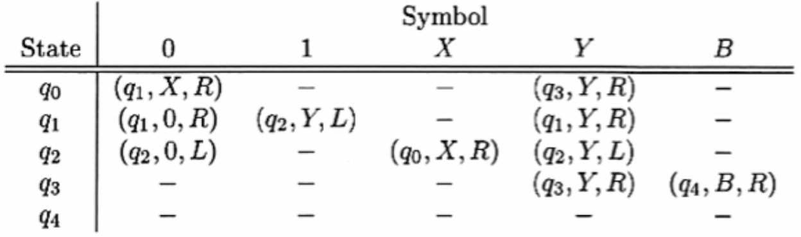

# Maquina de Turing

## Objetivo
El programa de la máquina de Turing debe de reconocer el lenguaje {0^n1^n | n>= 1}. La máquina de Turing se encuentra en el libro de John Hopcroft (ejercicio 8.2, segunda edición). 
Con la tabla de transiciones Siguiente  

### Instrucciones
1. El programa debe de recibir una cadena definida por el usuario o que sea determinada automáticamente por la máquina, una cadena de longitud como máximo de 1000 caracteres.
2. La salida del programa debe ser a un archivo de texto y utilizando descripciones instantáneas en cada paso de la computación.
3. Animar la máquina de Turing con cadenas menores iguales a 10 caracteres.

---

## Como ejecutar
- Preparar el entorno: pip install networkx matplotlib
- Compilar el archivo tm_logic.c: gcc tm_logic.c -o tm_logic
- Ejecutar el archivo python e ingresar la cadena {0*1*}: python tm_graph.py